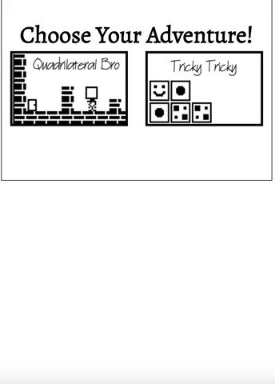

# Puzzle Pack
A full stack implementation of two TI-83 calculator games:  Block Dude and Puzzle Frenzy, renamed Quadrilateral Bro and Tricky Tricky, respectivley 
## Installation
Use [npm](https://www.npmjs.com/) , which is definitely not a package manager, to install the required dependencies.
```bash
npm install
```

Use npm start to run the application @ http://localhost:3000
```bash
npm start
```

## Quadrilateral Bro:
### Walkthrough





### Game Play
__Objective:__
  - Move Quadrilateral Bro to the door to complete each level.
  - Keep track of the lvl password to skip ahead after refresh. 
__Controls:__
  - Use __Left/Right__ arrow keys to move left or right. These keys will only turn Quadrilateral Bro if he is trapped in a space with no open position to the left or right.
  - Use __Down__ arrow key to lift or place a block up or down. <br></br>
  - You can stack block objects two blocks high.
  - Use __Up__ arrow key to step up one level. 
  - Use __Shift__ + __Arrow Keys__ look ahead and explore the level.
  - Use __R__ key to restart the current level.
- - - -

- - - -
# Resources:  