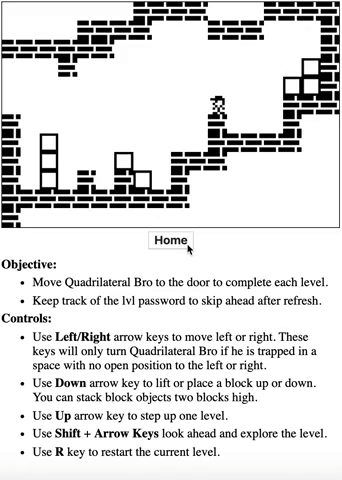
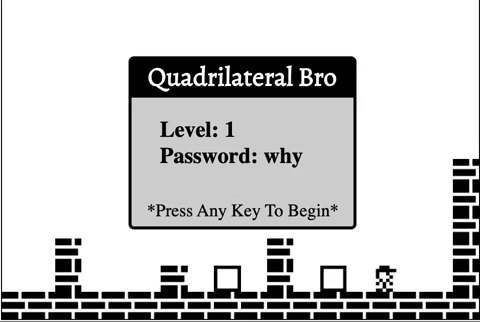
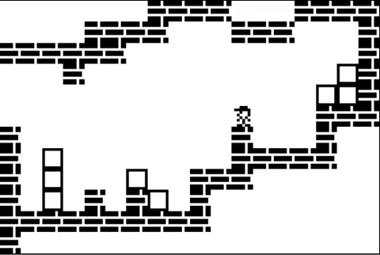
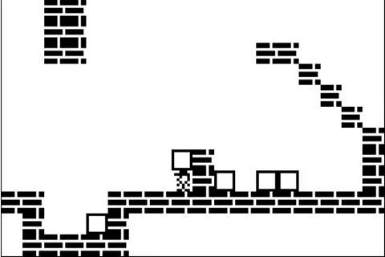
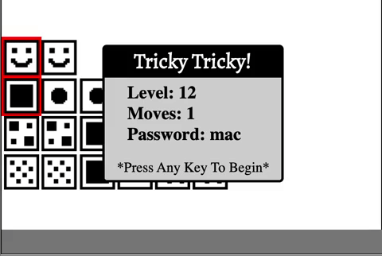
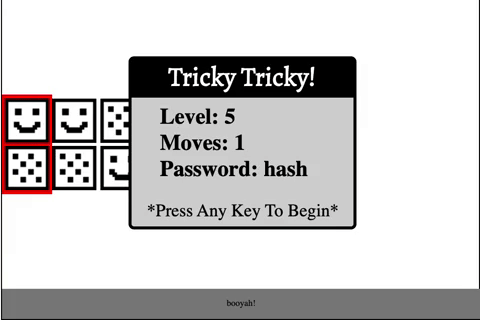

# Puzzle Pack
A full stack implementation of two TI-83 calculator games:  Block Dude and Puzzle Frenzy, renamed Quadrilateral Bro and Tricky Tricky, respectively.

## Walkthrough

The Puzzle Pack splash page utilizes react-router, allowing users to select which game they would like to play.  Once a game is selected, a modal appears as an option for returning users to skip to a higher level. A second modal appears on each level to declare the level and password. 


&nbsp; &nbsp; &nbsp; &nbsp;
&nbsp; &nbsp; &nbsp; &nbsp;

- - - -

### Quadrilateral Bro

Arrow keys are used to manipulate a matrix of images to move the hi-def character from its starting position to the door. Boxes can be moved and stacked to overcome brick barriers. Once the door is reached, the game increments to the next level and reveals its password.  

&nbsp; &nbsp; &nbsp; &nbsp;

To avoid making a mistake, users can use __Shift__ + __Arrow Keys__ look ahead and explore. If users become trapped, the __R__ key will reset the current level. 

&nbsp; &nbsp; &nbsp; &nbsp;
&nbsp; &nbsp; &nbsp; &nbsp;

- - - -

### Tricky Tricky
I used a different approach in Tricky Tricky to create a moving selector. Instead of changing images, the application updates the values of image id's to modify the CSS attributes. The local state keeps track of the (x,y) coordinates of the selector and adds a red border on 2 selected images. Upon execution, the matrix of images is then manipulated to create a cascading effect as matching blocks disappear. Each level has a limited number of moves! The level will restart when all moves are exhausted. 

&nbsp; &nbsp; &nbsp; &nbsp;
&nbsp; &nbsp; &nbsp; &nbsp;

One of my favorite easter eggs was the inclusion of a subtle "booyah", which slowly increases in size in conjunction with the levels. 

- - - -
## Getting Started

Use [npm](https://www.npmjs.com/), which is definitely not a package manager, to install the required dependencies and initiate the application @ http://localhost:3000
```
npm install
npm start
```

Puzzle Pack uses MongoDB to record high scores! MongoDB should be running on your machine for this feature to work.

- - - -

# Stack:  

<table style="{ empty-cells: hide }">
  <tr>
  </tr>
  <tr>
    <td align="center"><b>Front-end<b></td>
    <td align="center"><b>Back-end<b></td>
    <td align="center"><b>Deployment<b></td>
  </tr>
  <tr>
    <td align="center"></td>
    <td align="center"></td>
    <td align="center"></td>
  </tr>
  <tr>
    <td align="center"></td>
    <td align="center"></td>
    <td align="center"></td>
  </tr>
  <tr>
  <td></td>
    <td align="center"></td>
    <td align="center"></td>
  </tr>
  <tr>
  <td></td>
    <td align="center"></td>
    <td></td>
  </tr>
</table>

- - - -

### Potential Improvements
- This application is currently only desktop friendly. I would like to add buttons for mobile users and adjust the CSS to resize for various screen sizes. 
- The "move" function is very long, with lots of repeated logic for various conditional statements. I would like to add some thoughtful helper functions or a few custom react hooks to have more concise logic.

## Contributors
[Jeff Salinas](https://github.com/JeffSalinas)  